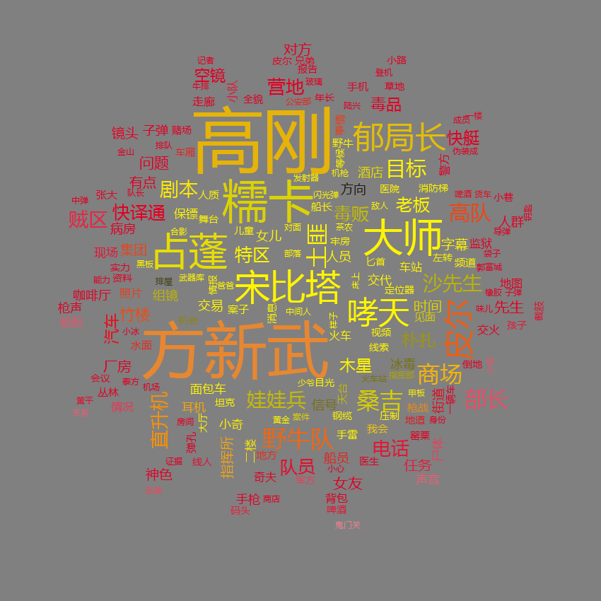
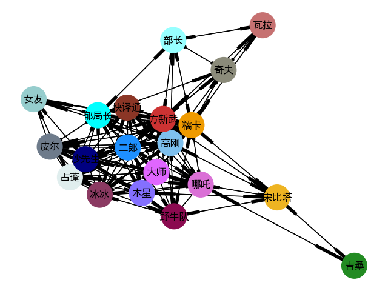

# 《湄公河行动》词云分析
## 分词
### 收集字典，加载停用词
从百度百科中下载《湄公河行动》的角色名称，写入dict.txt，构建user_dict。下载stopwords，在分词中去除停用词。

### 词性标注
使用jieba中的posseg模块进行分词和词性标注。

## 绘制词云

* 反映角色的词云

若保留名词和加载的字典中的特殊词汇（姓名），绘制的词云中大部分反映的是在剧中多次出现的人物，通过词云可以了解本剧的主要人物。

* 反映主要内容的词云

不保留人物姓名，只用名词作为词云绘制的主要内容，则词云反映的是此剧的主要内容。

词云显示，毒品，毒贩，子弹，直升机等词语比较关键，可以猜测该电影可能主要讲述的是与毒品有关的故事，而且带有战争和杀戮的片段。
## 关系网络图
根据人物在每段内共同出现的次数来衡量人物之间的关系，次数越多，关系越强。

统计完共同出现次数，根据统计结果，绘制网络图，通过网络图，可以人物之间的关系强度有一定的了解

根据网络图，结合词云中以角色为主的词云图，可以发现高刚，糯卡，方新武等多次出现的人物之间的关系也是非常紧密的

